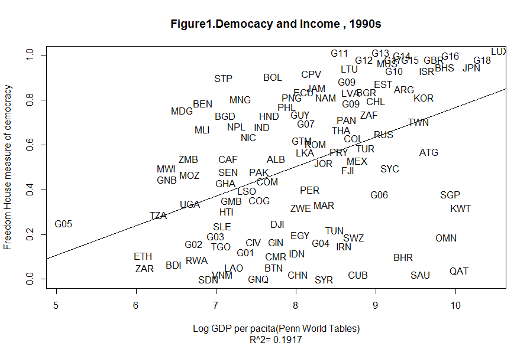

[](http://quantlet.de/)

## [](http://quantlet.de/) **Deocracy And Income, 1990s** [](http://quantlet.de/)

```yaml

Name of Quantlet:  'Democracy and Income, 1990s'
Published in:      'Income and Democracy'
Description:       'Plot average of Freedom House democracy index and log GDP per capita in 1990s' 
Keywords:          'democracy, income per capita, plot'
See also:          
Author:            'Hyerin Park, Sharong Jiang, Soichi Kajisa'
Submitted:         'Fri, March 10 2017 by Soichi Kajisa'
Datafile:          'ave1990s.xlsx'
Input:  
Output:  
Example:  

```



### R Code:
```r
library(maptools)

result=lm(fhpolrigaug~lrgdpch,data=ave1990s)
R2=signif(summary(result)$r.squared,digit=4)
R="R^2="

plot(fhpolrigaug~lrgdpch,data=ave1990s,col="white",
     ylab="Freedom House measure of democracy",xlab="Log GDP per pacita(Penn World Tables)",
     sub=paste(R,R2))
pointLabel(x=ave1990s$lrgdpch,y=ave1990s$fhpolrigaug,labels=ave1990s$code,col="black")

abline(result)
```
